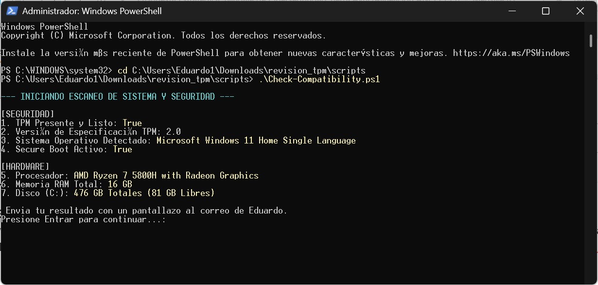

# Guía de Uso: Script de Revisión de TPM y Compatibilidad

Este script (`Check-Compatibility.ps1`) verifica de manera rápida si un equipo cumple con los requisitos mínimos de seguridad (TPM 2.0, Secure Boot y Sistema Operativo) para la implementacuón de politicas de seguridad TA

## Requisitos Previos

*   **Sistema Operativo:** Windows 11.
*   **Permisos:** Debes ejecutar PowerShell como **Administrador**.

---

## Instrucciones para Ejecutar en Windows 11

Sigue estos pasos para ejecutar el script correctamente:

### 1. Abrir PowerShell como Administrador

1.  Presiona la tecla **Windows** 🪟 en tu teclado.
2.  Escribe `PowerShell`.
3.  En los resultados, busca **Windows PowerShell** o **Terminal** y haz clic derecho sobre él.
4.  Selecciona **"Ejecutar como administrador"** (Run as administrator).
5.  Si aparece una ventana de Control de Cuentas de Usuario, haz clic en **"Sí"**.

### 2. Habilitar la ejecución de scripts (Si es necesario)

Por defecto, Windows puede bloquear la ejecución de scripts. En la ventana de PowerShell que abriste, escribe el siguiente comando y presiona **Enter**:

```powershell
Set-ExecutionPolicy -ExecutionPolicy RemoteSigned -Scope Process
```
*(Escribe `S` o `Y` si te pide confirmación).*

### 3. Ejecutar el Script

Tienes dos formas de hacerlo:

#### Opción A: Arrastrar y soltar (Más fácil)
1.  Busca el archivo `Check-Compatibility.ps1` en tu carpeta de descargas o donde lo tengas guardado.
2.  **Abre y copia todo lo que tiene el archivo** .
3.  **Pega en la consola de powershell** pega directamente dentro de la ventana de PowerShell de administrador.
4.  ¡Presiona **Enter**!

**Valores de SEGURIDAD:** Si alguno es `False` o `Home`, favor reportar al Delegado de Seguridad.

#### Opción B: Por línea de comandos
Navega hasta la carpeta y ejecútalo:
```powershell
cd "C:\Ruta\A\Tu\Carpeta\scripts"
.\Check-Compatibility.ps1
```




**Valores de SEGURIDAD:** Si alguno es `False` o `Home`, favor reportar al Delegado de Seguridad.

### 4. Revisar los Resultados

El script mostrará en pantalla la siguiente información detallada:

**[SEGURIDAD]**
*   **TPM Presente y Listo:** Debe ser `True`.
*   **Versión TPM:** Debe ser `2.0`.
*   **Sistema Operativo:** Detalla la edición de Windows detectada.
*   **Secure Boot Activo:** Debe ser `True`.

**[HARDWARE]**
*   **Procesador:** Modelo exacto de la CPU.
*   **Memoria RAM Total:** Cantidad en GB instalada.
*   **Disco (C:):** Tamaño total y espacio libre actual.


Presiona cualquier tecla para cerrar la ventana cuando termines.

---
> [!IMPORTANT]
> Nunca ejecutes scripts de fuentes desconocidas. Este script ha sido diseñado únicamente para auditoría interna de compatibilidad.
